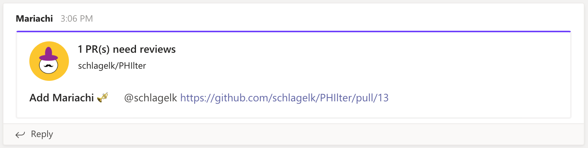

#  Mariachi 


## What is Mariachi?
Mariachi sends Pull Request review reminders to MSFT Teams channels.  You can configure it to run for Pull Requests in your GitHub repo with a single `mariachi.yml` file, or set it up to run on your servers when you want.  Set the minimum required reviews for each PR, PR labels you wish to ignore and add head branch prefixes to exclude.

### Requirements
You only need to be able to do the following 2 things to add Mariachi and start receiving review reminders in Teams
1. Create an Incoming Webhook Connector in MSFT Teams (see Creating an Incoming Webhook Connector MSFT Teams).
2. Configure the Mariachi exectuable to run when you want (see Configuring Mariachi for examples).

### Creating an Incoming Webhook Connector MSFT Teams
Follow the steps [here](https://docs.microsoft.com/en-us/microsoftteams/platform/webhooks-and-connectors/how-to/add-incoming-webhook#add-an-incoming-webhook-to-a-teams-channel) to create a connector in the Teams channel where you wish to receive reminders.  Copy the URL at the last step, as we you will need it when configuring Mariachi next.

### Configuring Mariachi
(TODO, add a GH Actions part and a CircleCI part)
You can set Mariachi to run on a schedule like below, or on any event your heart desires.  Just add a `mariachi.yml` config file to your `.github/workflows` directory. See [here](https://docs.github.com/en/actions/reference/events-that-trigger-workflows#scheduled-events) for how to configure this on a schedule.

```yml
name: Mariachi
on:
  schedule:
    - cron: "0 0 * * *"
jobs:
  remind:
    runs-on: ubuntu-latest
    steps:
    - name: Mariachi
      uses: docker://schlagelk/mariachi:latest
      with:
        github_token: ${{ secrets.GITHUB_TOKEN }}
        teams_url: ${{ secrets.TEAMS_TOKEN }}
        exclude_heads: release,foo,bar
        exclude_labels: skip-mariachi,do not review
        min_reviews: 3
```

### Parameters (TODO: redo this)

***github_token (required)***

The GitHub token to use - GitHub creates one by default for you and you can use that `${{ secrets.GITHUB_TOKEN }}`.

***teams_url (required)***

****GITHUB_REPOSITORY (required)****

TODO this is required

The Teams webhook URL.  If you followed the instructions above and added it to your secrets store, you can use `${{ secrets.TEAMS_TOKEN }}`.

***exclude_heads (optional)***

You can configure Mariachi to exclude PRs with head branches that begin with certain words.  Add them as a comma separated single string without spaces (eg: `release,test`).

***exclude_labels (optional)***

You can configure Mariachi to exclude PRs with certain labels. Add them as a comma separated single string without spaces in between (eg `skip-mariachi,do not review`).

***min_reviews (optional)***

The minimum number of reviews needed to have Mariachi notify Teams (default is 2).  A review is either an approval or a request for changes, but not a comment.

### What Counts as a Review? ###
Mariachi considers a review to be either an approval or a request for changes.

### What Does a Reminder Look Like? ###


### Can I Fork Mariachi for My Enterprise Needs? ###
Yes - Mariachi is published under the Apache 2.0 license.  For more information, please view the [LICENSE.txt](https://github.com/schlagelk/Mariachi/blob/master/LICENSE.txt) file.

### Building and Developing Mariachi ####
Mariachi is built with Apple's Swift language, [Swift Argument Parser](https://github.com/apple/swift-argument-parser) and Swift Package Manager.  You can clone the repo and open `Package.swift` to launch the project in Xcode.  If you wish to build and run the Mariachi executbale, you can run `swift build -c release` from the project root - this gives you an exectuable located at `.build/release/mariachi` ready for release.

The project also comes with some very basic unit tests - you can run those from the project root using `swift test` or using Xcode's interface.

The suggested way of deploying the Mariachi executable is to use Docker.  This project contains a Dockerfile as well as an entrypoint script (entrypoint.sh) used by the Docker container.  This script just checks if certain variables are set before executing the Mariachi exectuable on the server where configured.
